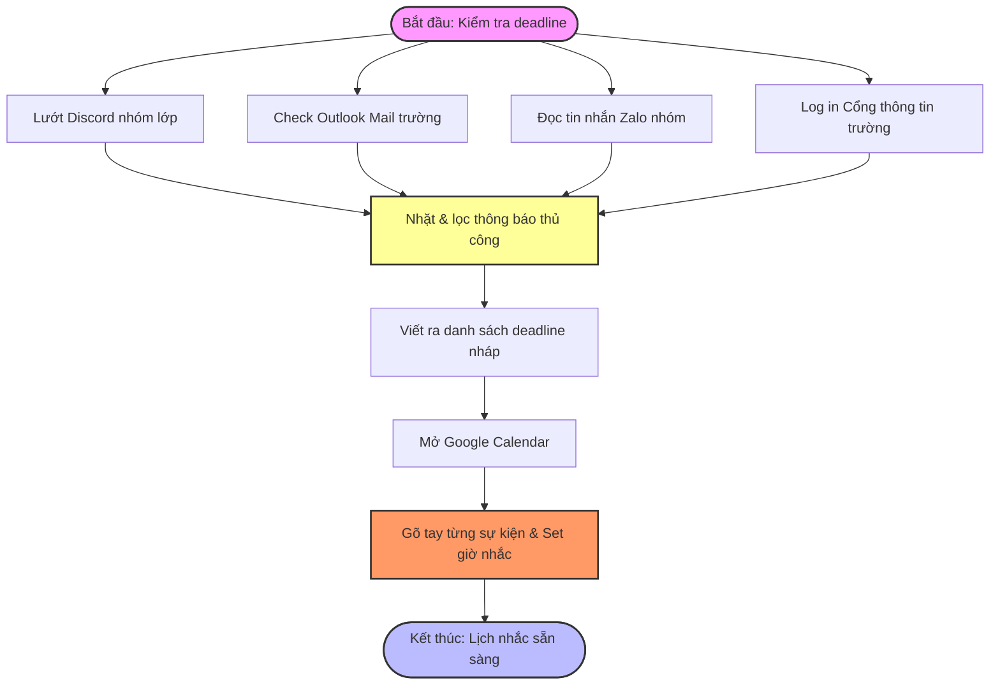

---

# 01 — Individual Problem Scan

## Scan rộng

Dưới đây là bảng scan rộng :

| # | Lăng kính | Problem quan sát được | Ai đang đau? | Dấu hiệu thật |
| --- | --- | --- | --- | --- |
| 1 | Lặp lại | **Mỗi tuần phải lướt Discord, Outlook, Zalo, Cổng thông tin để nhặt deadline** | Học sinh/Sinh viên (Em) | Mất 45-60 phút mỗi cuối tuần để rà soát thủ công |
| 2 | Tốn thời gian | **Tự gõ lại danh sách deadline và tạo lịch nhắc trên Google Calendar** | Học sinh/Sinh viên (Em) | Dễ gõ sai ngày, sót giờ, mất thêm 20 phút |
| 3 | AI có thể tốt hơn | Discord/Zalo không tự nhận diện context tin nhắn chứa deadline để push lịch | Học sinh/Sinh viên | Tin nhắn trôi nhanh, lướt tìm lại rất mệt |
| 4 | Pain từ người khác | Giảng viên/Lớp trưởng đổi lịch đột xuất trên Zalo nhưng không check kịp | Em và các bạn trong lớp | Bị động, dễ sót các buổi workshop/thảo luận |
| 5 | Lặp lại | Cuối tuần phải đọc lại sổ tay viết tay nguệch ngoạc để gõ lại vào MS Word | Học sinh/Sinh viên (Em) | Mất nhiều thời gian gõ lại từ đầu |
| 6 | Tốn thời gian | Tìm kiếm tài liệu liên quan trên Internet để bổ sung vào bài học | Học sinh/Sinh viên (Em) | Mất 30-45 phút tìm nguồn uy tín |
| 7 | AI có thể tốt hơn | MS Word không tự nhận diện chữ viết tay xấu để chuyển thành text chỉn chu | Học sinh/Sinh viên (Em) | Tốn công căng mắt đọc lại chữ của chính mình |
| 8 | Tốn thời gian | Đi bộ và chờ xe bus 45 phút mỗi ngày đến trường dưới thời tiết oi bức Hà Nội | Em (Sinh viên mới ra Bắc) | Mệt mỏi, giảm năng suất học tập khi đến trường |
| 9 | AI có thể tốt hơn | App tìm bus không tối ưu hóa chặng đi bộ tránh nắng hoặc gợi ý giờ đi mát nhất | Em | Phải đi bộ 25 phút tổng cộng giữa trời nắng |
| 10 | Pain từ người khác | Lộ trình bus thay đổi hoặc hoãn chuyến do tắc đường Hà Nội không báo trước | Người đi xe bus | Chờ đợi vô định ở trạm dừng |

## Top 3

| Rank | Problem | Vì sao chọn | Điều còn chưa chắc |
| --- | --- | --- | --- |
| **1** | **Theo dõi & Cập nhật deadline từ nhiều nguồn** | **Workflow rõ ràng, lặp lại cố định hằng tuần, có tính kết nối dữ liệu cao, AI xử lý context ngôn ngữ rất tốt.** | Cách kết nối API hoặc lấy dữ liệu tự động từ Zalo/Discord bảo mật như thế nào. |
| 2 | Số hóa ghi chú viết tay cuối tuần | Có pain thật, quy trình đơn giản nhưng mang tính xử lý dữ liệu một nguồn. | Xử lý chữ viết tay quá "nguệch ngoạc" thì AI/OCR có nhận diện chuẩn không. |
| 3 | Di chuyển bằng xe bus tại Hà Nội | Pain về trải nghiệm cá nhân rất lớn. | Khó can thiệp bằng AI thông thường, phụ thuộc nhiều vào yếu tố hạ tầng/thời tiết. |

---

## Problem Card #1 — Theo dõi và cập nhật deadline

**Problem 1 câu:** Mỗi tuần em mất hơn 60 phút lướt thủ công qua 4 nền tảng (Discord, Outlook, Zalo, Cổng thông tin) để nhặt thông báo, dễ bị sót hoặc gõ sai khi tự tạo lịch nhắc trên Google Calendar.

**Actor:** Sinh viên (Em) cần quản lý lịch học, bài tập, workshop và các buổi thảo luận nhóm.

**Thời điểm / bối cảnh:** Cuối tuần hoặc cuối ngày khi các nguồn thông tin dồn về nhiều.

**Current workflow:**

```text
1. Mở Discord nhóm lớp -> Lướt tìm tin nhắn tag hoặc thông báo bài tập.
2. Mở Outlook email trường -> Đọc và lọc các mail deadline, lịch học.
3. Mở Zalo nhóm chat -> Đọc recap hoặc tin nhắn ghim của lớp trưởng.
4. Đăng nhập Cổng thông tin trường -> Check mục thông báo/lịch thi.
5. Tổng hợp tất cả deadline ra một danh sách nháp.
6. Mở Google Calendar -> Tự gõ tay từng sự kiện, set ngày giờ, tạo lịch nhắc.

```

**Bottleneck:** Bước 1, 2, 3, 4 (Đọc và lọc thông tin thủ công từ nhiều nguồn rời rạc, tin nhắn dễ trôi) và Bước 6 (Gõ thủ công lên Calendar dễ sai sót, mất thời gian).

**Impact:** Mất 60-80 phút/tuần. Nếu sót thông báo sẽ bị trễ bài tập lớn, lỡ workshop quan trọng, ảnh hưởng trực tiếp đến kết quả học tập.

**Success metric:** Giảm tổng thời gian gom deadline và lên lịch từ **60 phút xuống dưới 10 phút/tuần**. Tỉ lệ sót deadline bằng 0.

**Non-AI alternative:** Sử dụng một file Notion tập trung để lưu link các nguồn, kết hợp dùng tính năng "Flag" (gắn cờ) của Outlook và "Ghim" của Zalo, nhưng vẫn phải tự đọc và tự gõ tay vào lịch.

**AI hypothesis:** AI (LLM) hỗ trợ đọc hiểu văn bản, trích xuất thực thể (Event, Date, Time, Platform) từ các đoạn chat/email thô, sau đó thông qua công cụ tự động hóa (Workflow) đẩy thẳng sang Google Calendar.

**Quick gut:** Workflow kết hợp Rule-based Automation.

---

### Draft current workflow 

Để push lên Git hiển thị thành hình ảnh, đoạn code Mermaid của quy trình hiện tại sẽ như sau:



---

### Draft future workflow

```text
FUTURE STATE — 10 phút

[1 Auto-fetch/Paste data: 3']  -- Người dùng copy text/hoặc dùng webhook tự động gom thông báo về 1 chỗ
→ [2 AI phân tích & trích xuất: 1'] -- AI đọc hiểu, tự bóc tách: Tên bài tập, Hạn nộp, Nguồn
→ [3 Click phê duyệt lịch: 2']    -- Human boundary: Kiểm tra lại xem AI xếp lịch đúng chưa
→ [4 Auto-push Google Calendar: 1'] -- Hệ thống tự động đồng bộ hóa lên lịch
→ [5 Nhận thông báo tự động: 3']  -- Google Calendar tự gửi notification về máy điện thoại

Fallback: Nếu AI trích xuất sai ngày -> Người dùng sửa tay ngay trên giao diện duyệt trước khi push lên Calendar.

```

## Problem Cards #2 và #3 — tóm tắt

| Card | Actor | Bottleneck | Metric | Quick gut | Vì sao chưa chọn làm #1 |
| --- | --- | --- | --- | --- | --- |
| **Số hóa ghi chú viết tay** (Ý tưởng 1) | Em (Học sinh) | Đọc chữ viết ngoáy và gõ lại toàn bộ văn bản vào MS Word. | 60 phút → 15 phút | Workflow (Xử lý ảnh OCR + AI biên tập) | Chỉ xử lý từ 1 nguồn duy nhất (sổ tay), ít tính kết nối phức tạp bằng ý tưởng 2. |
| **Thích nghi xe bus Hà Nội** (Ý tưởng 3) | Em (Sinh viên mới) | Đi bộ lâu dưới trời nắng nóng, thiếu thông tin lộ trình tối ưu thời tiết. | 45 phút → 30 phút mệt mỏi | Agent / App thông minh | Yếu tố ngoại cảnh (thời tiết, hạ tầng giao thông) khó giải quyết triệt để bằng AI thuần túy. |

---

